## 
Include the tankextensions_main script file and the tank script files of your choosing. This is done through a RunScriptCode output on bignet or added to your own mission script file if you have one.<br>
```wren
// For including the main script and two tank scripts.
InitWaveOutput
{
	Target bignet
	Action RunScriptCode
	Param
	"IncludeScript(`tankextensions_main`, getroottable())
	IncludeScript(`tankextensions/paratank`, getroottable())
	IncludeScript(`tankextensions/tankdozer`, getroottable())"
}
```
Then set the Name keyvalue of any tank in the popfile to one of the possible tank names from the included scripts.<br>
More basic usage can be found in the [example popfile](mvm_slick_v4a_tankextensions.pop). Tank names and script functions are listed further down this readme.<br>
If you want to make a new tank type, refer to the [example tank script](scripts/vscripts/tankextensions/exampletank.nut).

## 
Path Maker allows for quickly creating paths without the need for going around the map using getpos or opening the hammer editor.<br>
After loading tankextensions_main use this command: `ent_fire !activator runscriptcode "TankExt.PathMaker(self)"`<br>
Replace `ent_fire` with `sm_ent_fire` if on a testing.potato.tf server.<br>
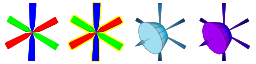<br>
**Axis nodes** are your placed path nodes, a yellow outlined node is the last placed node and can be deleted with the secondary fire.<br>
**Blue guides** are path nodes that already exist in the map, their targetname will be shown above them and point towards their next path node.<br>
The **purple guide** is the best position for your last path node for a tank deploying a bomb.<br>
Once finished, you can print all your path nodes in the format of TankExt, PopExt+, or Rafmod to console.<br>
Note that using TankExtensions's CreatePaths function will merge the last node to a node in the map if they share the same position.

## 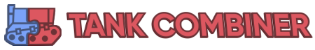
Any tank made via TankExtensions can be combined into one; providing all the functionality of the chosen tanks at once.<br>
Usage is by adding multiple tank names separated by `^` into the tank's Name keyvalue. (i.e. `Name "painttank|255 127 0^stickytank^paratank^fireringtank"`)<br>
Any combined tanks will use the targetname of `combinedtank`.<br>
Also note that custom keyvalues defined in NewTankType, besides OnSpawn and OnDeath, will only apply once when iterating through the tanks. For example, `"redtank^painttank|255 0 0"` will apply the Red Tank model but not the Paint Tank model, vice versa if the names are swapped around.

## 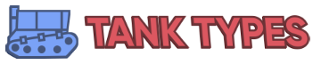
This list provides details on what can go into a tank's Name keyvalue.<br>
**Suffixes** is text that can be appended to the tank's name for different effects, these will be kept in the tank's targetname when spawning. <code>tankName</code> + <code>_suffix1</code> + <code>_suffix2</code> == <code>tankName_suffix1_suffix2</code><br>
**Parameters** are separated by `|` and can modify certain aspects of the tank type, these will be removed from the tank's targetname when spawning. <code>tankName</code> with 2 parameters is <code>tankName|parameter1|parameter2</code><br>
**Quick Keyvalues** allow for making slight modifications to the tank, the same keyvalues as the NewTankType function. The beginning of the keyvalues is denoted with `$`, the values of the keys separated with `|`, and the keyvalues themselves separated with `^`. `tankName$color|0 0 0^teamnum|2^scale|0.5` would result in a black tank on red team at half scale.<br>
Here's a tank name with everything combined, including when using Tank Combiner, `Name "paratank^combattank_nolaser|minigun|rocketpod$teamnum|2^noscreenshake|1"`<br>
**ScriptFunctions** can be ran by firing a CallScriptFunction input on the tank with the param being the script function name.
<table>
	<tr>
		<th>Script File</th>
		<th>Preview</th>
		<th>Tank Names</th>
		<th>Suffixes</th>
		<th># of Parameters</th>
		<th>ScriptFunctions</th>
		<th>Description</th>
	</tr>
	<tr>
		<td>bannertank.nut</td>
		<td>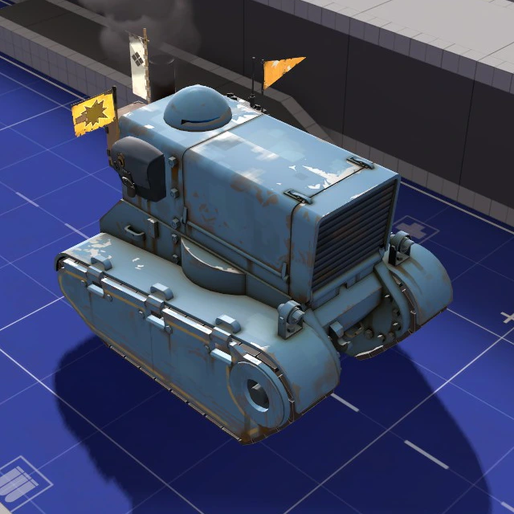</img></td>
		<td>
			<code>bannertank</code>
		</td>
		<td>
			<code>_backup</code><br>
			<code>_buff</code><br>
			<code>_conch</code><br>
			<code>_noselfeffect</code>
		</td>
		<td>0</td>
		<td>
			AddBannerBackup<br>
			AddBannerBuff<br>
			AddBannerConch<br>
			RemoveBannerBackup<br>
			RemoveBannerBuff<br>
			RemoveBannerConch
		</td>
		<td>
			Applies the selected banner effects to all teammates within a 540hu radius. The tank can apply the same buffs to itself, toggleable through the <code>_noselfeffect</code> suffix.
		</td>
	</tr>
	<tr>
		<td>blimp.nut</td>
		<td>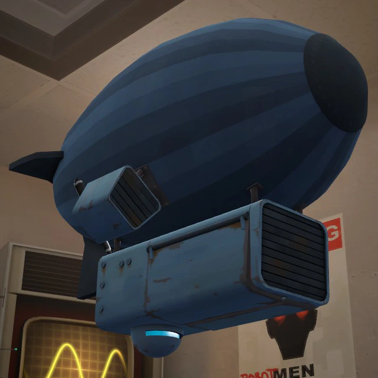</img></td>
		<td>
			<code>blimp</code>
		</td>
		<td></td>
		<td>0</td>
		<td></td>
		<td>
			Same as a normal tank but it traverses the sky.
			<p>Blimp model by <a href="https://steamcommunity.com/profiles/76561198058809573">Glitch</a></p>
		</td>
	</tr>
	<tr>
		<td>chewchewtank.nut</td>
		<td>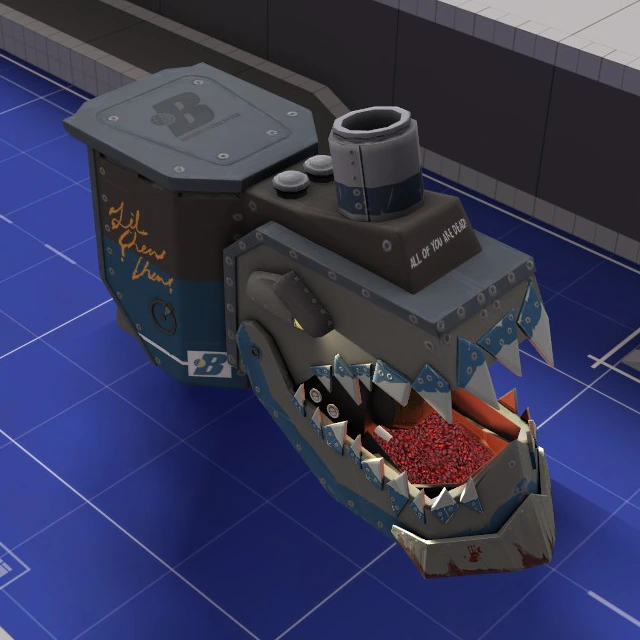</img></td>
		<td>
			<code>chewchewtank</code>
		</td>
		<td></td>
		<td>0</td>
		<td></td>
		<td>
			Li'l Chew Chew from pl_frontier but in tank form. Each bite deals 1000 damage and does not effect giants.
		</td>
	</tr>
	<tr>
		<td>combattank.nut</td>
		<td>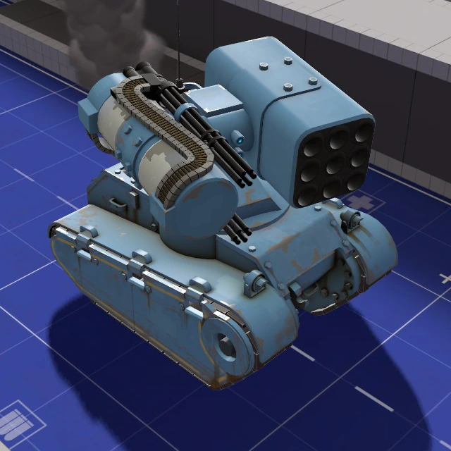</img></td>
		<td>
			<code>combattank</code>
		</td>
		<td>
			<code>_nolaser</code>
		</td>
		<td class="paramvalue">2</td>
		<td>
			ToggleUber
		</td>
		<td>
			Weaponized tank. <b>The tank will need to be prevented from reaching the last path node because it does not have a deploy sequence. Create a looping path or set the tank speed to 0 when it gets close to the last path to prevent this from occurring.</b> This comes with its own script files for each weapon within <code>tankextensions/combattank_weapons/</code>. Load those scripts like you would with tanks; the weapon names go into either of the tank's parameters.
			<table>
				<tr>
					<th>Script File</th>
					<th>Weapon Names</th>
				</tr>
				<tr>
					<td>minigun.nut</td>
					<td>minigun</td>
				</tr>
				<tr>
					<td>railgun.nut</td>
					<td>railgun</td>
				</tr>
				<tr>
					<td>rocketpod.nut</td>
					<td>rocketpod<br>rocketpod_homing</td>
				</tr>
			</table>
			<code>ToggleUber</code> makes the tank invulnerable until ToggleUber is used again. The <code>_nolaser</code> suffix prevents the laser beam from appearing when detecting an enemy.
			<p>Tank and weapon models by <a href="https://steamcommunity.com/profiles/76561198070293827">Charlie</a></p>
		</td>
	</tr>
	<tr>
		<td>drilltank.nut</td>
		<td>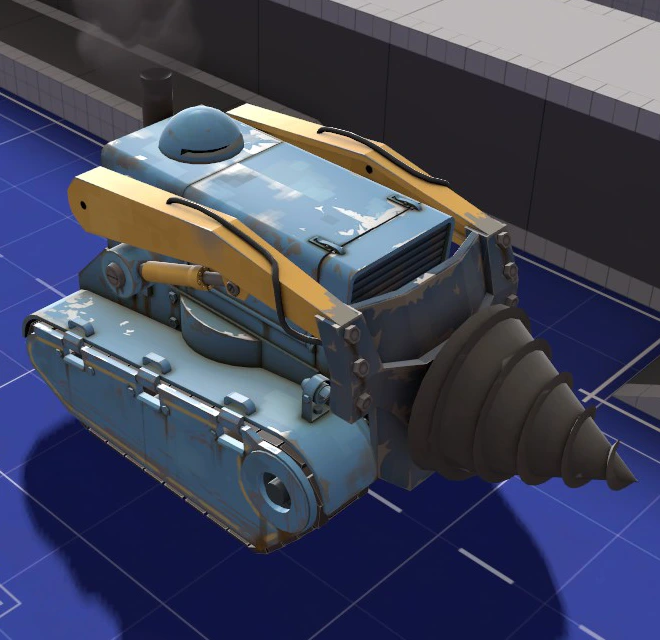</img></td>
		<td>
			<code>drilltank</code>
		</td>
		<td></td>
		<td>0</td>
		<td></td>
		<td>
			Adds a big drill at the front of the tank. Deals 50 damage to the victim every 0.33 seconds (150 dps) that applies bleed and 75% movement stun for 1 second. Deals no damage while in the bomb deploy sequence.
			<p>Drill model by <a href="https://steamcommunity.com/profiles/76561198139139265">KrazyZark</a></p>
		</td>
	</tr>
	<tr>
		<td>exampletank.nut</td>
		<td>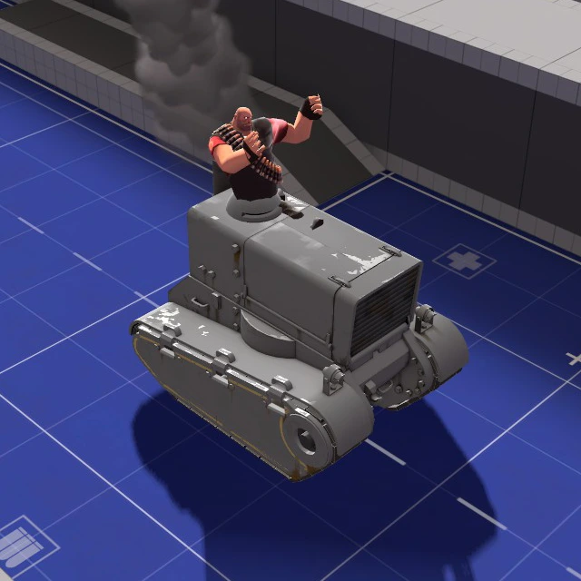</img></td>
		<td>
			<code>exampletank</code>
		</td>
		<td></td>
		<td>0</td>
		<td></td>
		<td>
			Used to show the basics in making a tank type
		</td>
	</tr>
	<tr>
		<td>fireringtank.nut</td>
		<td>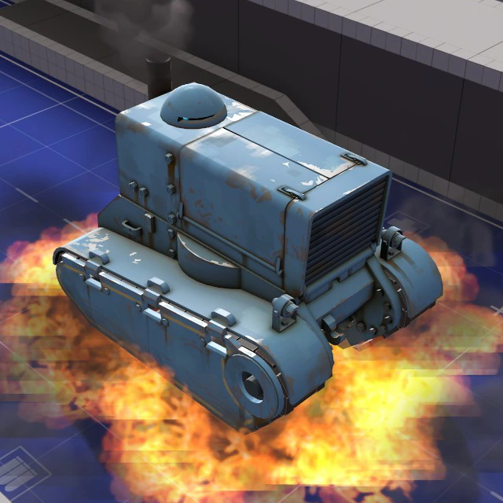</img></td>
		<td>
			<code>fireringtank</code>
		</td>
		<td></td>
		<td>0</td>
		<td></td>
		<td>
			Every 0.5 seconds will activate a trigger around the base of the tank that ignites enemies.
			<p>Concept by <a href="https://steamcommunity.com/profiles/76561198158093750">Bazooks</a></p>
		</td>
	</tr>
	<tr>
		<td>frontlinecart.nut</td>
		<td>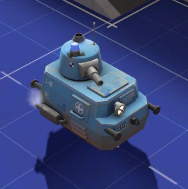</img></td>
		<td>
			<code>frontlinecart</code>
		</td>
		<td>
			<code>_crit</code>
		</td>
		<td class="paramvalue">2</td>
		<td></td>
		<td>
			Small mobile turret that shoots a chosen projectile at 5 angles. Allows 2 parameters of: <code>rocket</code>, <code>grenade</code>, <code>jarate</code>, <code>milk</code>, <code>gas</code>. First parameter is the normal projectile type and the second parameter is the close range projectile type. The second parameter can be left blank to not switch to close ranged projectiles. The <code>_crit</code> suffix makes all projectiles crit.
			<p>Cart model from the <a href="https://frontline.tf2maps.net">Frontline Supply Drop</a></p>
		</td>
	</tr>
	<tr>
		<td>hammertank.nut</td>
		<td>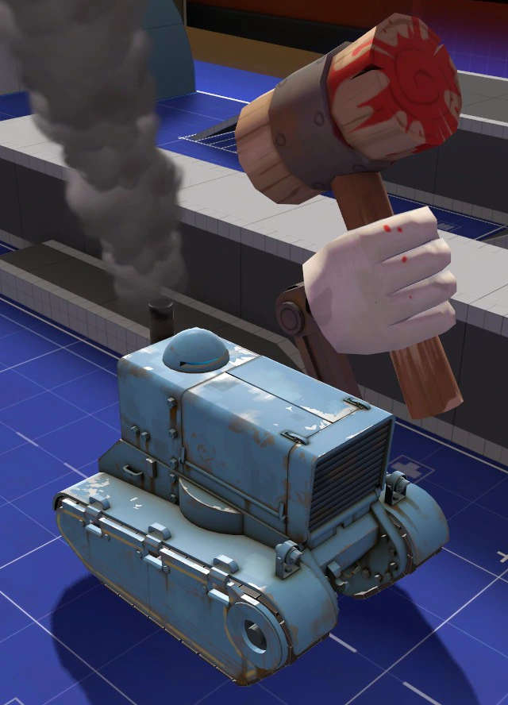</img></td>
		<td>
			<code>hammertank</code>
		</td>
		<td></td>
		<td>0</td>
		<td></td>
		<td>
			Adds a giant Necro Smasher onto the tank. Activates when an enemy is within a 256hu radius from its smashing position. Deals 2500 damage to enemies within a 128hu radius or pushes enemies away within a 384hu radius upon smashing. Has a 2.6 second cooldown after smashing.
			<p>Concept from <a href="https://steamcommunity.com/profiles/76561198000559913">Sntr</a>'s <a href="https://steamcommunity.com/sharedfiles/filedetails/?id=2710939862">Lost Valley</a></p>
		</td>
	</tr>
	<tr>
		<td>painttank.nut</td>
		<td>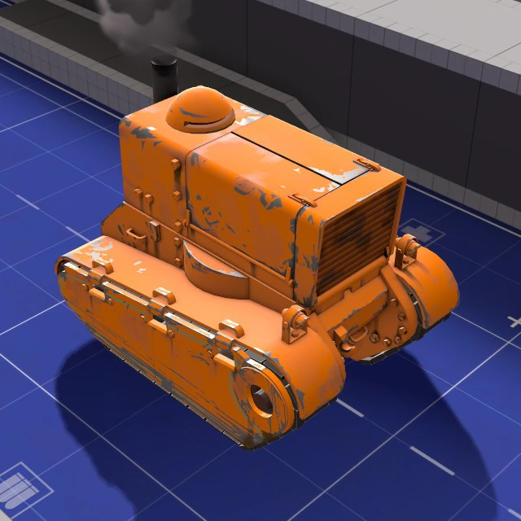</img></td>
		<td>
			<code>painttank</code>
		</td>
		<td></td>
		<td class="paramvalue">1</td>
		<td></td>
		<td>
			A tank model that allows for more colors much like adding paints for hats. First parameter is the color. (i.e. <code>"painttank|255 127 0"</code> results in an orange tank)
			<p>Tank model by <a href="https://steamcommunity.com/profiles/76561198036209556">CTriggerHurt</a></p>
		</td>
	</tr>
	<tr>
		<td>paratank.nut</td>
		<td>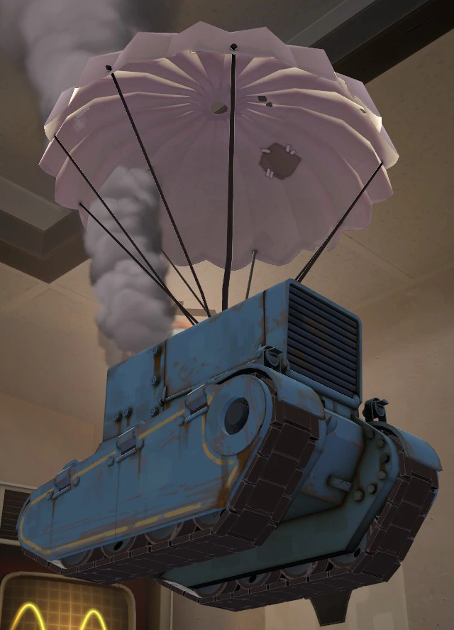</img></td>
		<td>
			<code>paratank</code>
		</td>
		<td></td>
		<td>0</td>
		<td></td>
		<td>
			Adds a parachute to the tank. If there's no floor underneath the tank then it will move towards path nodes similarly to a blimp until there's ground again. This will usually require a custom tank path so the tank's descent doesn't look unnatural.
			<p>Parachute model from <a href="https://steamcommunity.com/profiles/76561198041314432">PenolAkushari</a>'s <a href="https://steamcommunity.com/sharedfiles/filedetails/?id=1858986178">Silent Sky</a></p>
		</td>
	</tr>
	<tr>
		<td>redtank.nut</td>
		<td>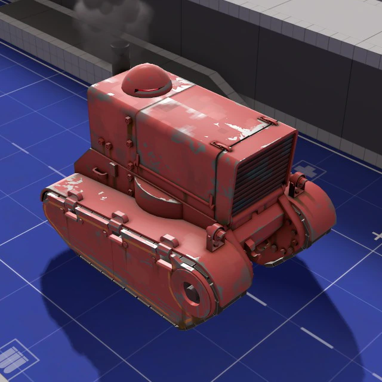</img></td>
		<td>
			<code>redtank</code>
		</td>
		<td></td>
		<td>0</td>
		<td></td>
		<td>
			Changes the tanks team to red and swaps the tank model with a red textured version. Useful when combined with other tank types that don't have custom models.
		</td>
	</tr>
	<tr>
		<td>sentrytank.nut</td>
		<td>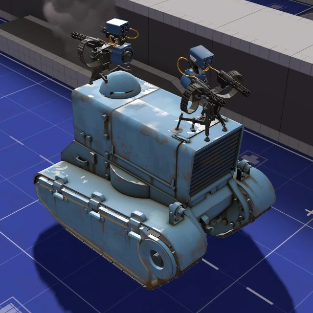</img></td>
		<td>
			<code>sentrytank</code>
		</td>
		<td></td>
		<td>0</td>
		<td></td>
		<td>
			Adds 2 invincible level 3 sentries ontop of the tank. The sentries cannot attack enemies that are directly beside the tank. Sappers destroy themselves after 8 seconds if placed on either of the sentries, Red-Tape Recorder does not degrade their levels.
		</td>
	</tr>
	<tr>
		<td>stickytank.nut</td>
		<td>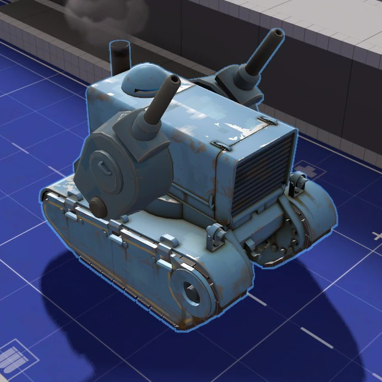</img></td>
		<td>
			<code>stickytank</code>
		</td>
		<td></td>
		<td>0</td>
		<td></td>
		<td>
			Fires a barrage of non-crit and crit stickies in front of the tank. Stickies detonate 7 seconds after the tank began firing.
			<p>Concept by <a href="https://steamcommunity.com/profiles/76561197965468138">Hell-met</a><br>Tank turret model from the <a href="https://frontline.tf2maps.net">Frontline Supply Drop</a></p>
		</td>
	</tr>
	<tr>
		<td>tankdozer.nut</td>
		<td>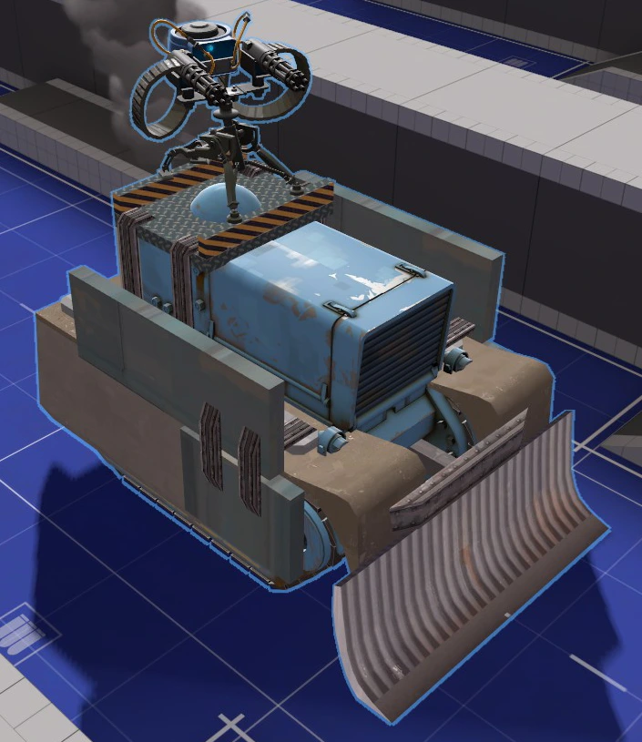</img></td>
		<td>
			<code>tankdozer</code>
		</td>
		<td>
			<code>_nosentry</code>
		</td>
		<td>0</td>
		<td></td>
		<td>
			An "armored" tank with 4 breakable sides and a big level 2 sentry ontop. The breakables have 2000 health each and the sentry has 9000 health. Players can get stuck inside of the tanks armor then crushed if they get too close. Sappers destroy themselves after 10 seconds when placed but deal extra damage to the sentry (500 health across 10 seconds.)
			<p>Concept by <a href="https://steamcommunity.com/profiles/76561198000559913">Sntr</a>'s <a href="https://steamcommunity.com/sharedfiles/filedetails/?id=1797845264">Rust Valley</a></p>
		</td>
	</tr>
	<tr>
		<td>targetank.nut</td>
		<td>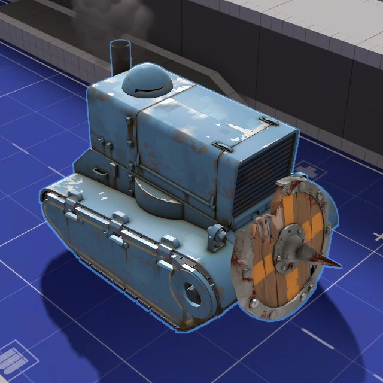</img></td>
		<td>
			<code>targetank</code><br>
			<code>targetank_color</code>
		</td>
		<td></td>
		<td>0</td>
		<td></td>
		<td>
			Charges similarly to demo's shields. The tank slows down to 15hu/s on the first 2 seconds then speeds up to 300hu/s for 3 seconds. Has a recharge duration of 10 seconds. Hitting an enemy deals 75 damage and high knockback. <code>targetank_color</code> sets the model to the PaintTank, the color reflects the tank's current charge meter (oranger when about to start a charge and redder after completing the charge.)
			<p>Concept by <a href="https://steamcommunity.com/profiles/76561198024198604">PDA Expert</a></p>
		</td>
	</tr>
	<tr>
		<td>teletank.nut</td>
		<td>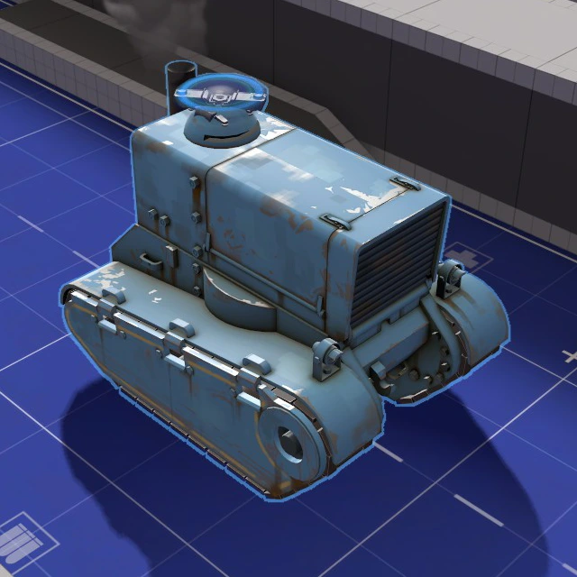</img></td>
		<td>
			<code>teletank</code>
		</td>
		<td></td>
		<td>0</td>
		<td></td>
		<td>
			Places a fake teleporter ontop of the tank that teleports spawned bots that have the <code>bot_teletank</code> tag. Teleported bots will spawn with 5 seconds of ubercharge.
			<p>Concept by <a href="https://steamcommunity.com/profiles/76561198115147053">dexc34</a></p>
		</td>
	</tr>
	<tr>
		<td>ubertank.nut</td>
		<td>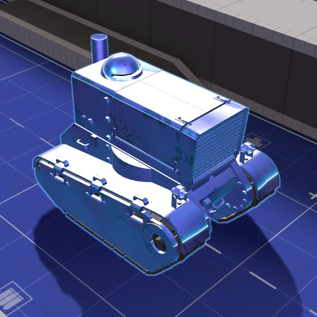</img></td>
		<td>
			<code>ubertank</code>
		</td>
		<td></td>
		<td class="paramvalue">2</td>
		<td>
			ToggleUber
		</td>
		<td>
			Has the ability to become invulnerable for a defined amount of time. First parameter is the amount of time after spawning until the tank becomes ubered and the second parameter is the duration of the uber. Setting either parameter to -1 will disable that parameter's functionality. <code>ToggleUber</code> flips the uber state, if a duration is set then it will automatically toggle back off after the given time.
			<p>Tank model by <a href="https://steamcommunity.com/profiles/76561198158093750">Bazooks</a></p>
		</td>
	</tr>
	<tr>
		<td>vactank.nut</td>
		<td>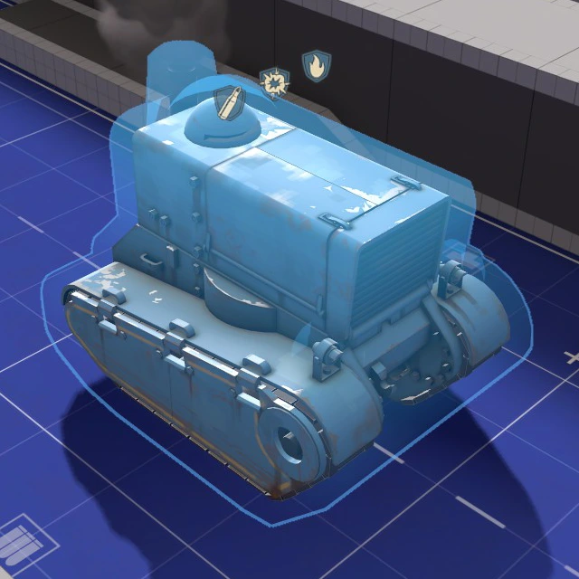</img></td>
		<td>
			<code>vactank</code>
		</td>
		<td>
			<code>_bullet</code><br>
			<code>_blast</code><br>
			<code>_fire</code><br>
		</td>
		<td>0</td>
		<td></td>
		<td>
			Adds any combination of the Vaccinator's uber effects to the tank. Adding a suffix will resist the chosen damage type.
			<p>Vaccinator bubble model by <a href="https://steamcommunity.com/profiles/76561198054722423">Tumby</a> and <a href="https://steamcommunity.com/profiles/76561198020560509">Izotope</a></p>
		</td>
	</tr>
</table>

## 
Always prepend <code>TankExt.</code> to any of these functions when using them. (i.e <code>NewTankType()</code> becomes <code>TankExt.NewTankType()</code>)
<table style="width=100%">
	<tr style="position:sticky; z-index:10; top:0">
		<th>Function</th>
		<th>Signature</th>
		<th>Description</th>
	</tr>
	<tr>
		<td><code>AddThinkToEnt</code></td>
		<td><code>void AddThinkToEnt(handle <i>entity</i>, string <i>FuncName</i>)</code></td>
		<td>
			Wrapper for <code>AddThinkToEnt</code>. If the entity is a tank then it will add the think function to its think table. If PopExt+ is loaded then it will use the renamed native function.
		</td>
	</tr>
	<tr>
		<td><code>ApplyTankTableByName</code></td>
		<td><code>void ApplyTankTableByName(handle <i>tank</i>, handle <i>path</i>, string <i>tankType</i>)</code></td>
		<td>
			Looks for a tank type that matches the inputted tank's name then applies what is given by the table.
		</td>
	</tr>
	<tr>
		<td><code>ApplyTankType</code></td>
		<td><code>void ApplyTankType(handle <i>tank</i>)</code></td>
		<td>
			Called by any path_track entity. First checks for any quick keyvalues, then runs <code>ApplyTankTableByName</code>.
		</td>
	</tr>
	<tr>
		<td><code>ApproachAngle</code></td>
		<td><code>float ApproachAngle(float <i>target</i>, float <i>input</i>, float <i>speed</i>)</code></td>
		<td>
			Rotates the inputted value by the speed value towards the target value. The returned angle value is normalized.
			<p>From the <a href="https://developer.valvesoftware.com/wiki/Team_Fortress_2/Scripting/VScript_Examples">TF2 VScript Examples</a> page</p>
		</td>
	</tr>
	<tr>
		<td><code>Clamp</code></td>
		<td><code>float Clamp(float <i>input</i>, float <i>low</i>, float <i>high</i>)</code></td>
		<td>
			If the input is below the low value, returns the low value. If above the high value, returns the high value.
		</td>
	</tr>
	<tr>
		<td><code>CreateLoopPaths</code></td>
		<td><code>void CreateLoopPaths(handle <i>table</i>)</code></td>
		<td>
			Similar to <code>CreatePaths</code> except it can make paths loop forever. The last node of each path must use the same position as a previously defined node.
		</td>
	</tr>
	<tr>
		<td><code>CreatePaths</code></td>
		<td><code>void CreatePaths(handle <i>table</i>)</code></td>
		<td>
			Can create multiple paths.
		</td>
	</tr>
	<tr>
		<td><code>DelayFunction</code></td>
		<td><code>void DelayFunction(handle <i>entity</i>, handle <i>scope</i>, float <i>delay</i>, handle <i>function</i>)</code></td>
		<td>
			Delays a function and calls it after the specified time. If an entity is defined then it will use its ScriptScope and can only call when the entity exists. The used scope can be overriden by the second parameter. The first two parameters can be left null if neither are needed.
		</td>
	</tr>
	<tr>
		<td><code>DispatchParticleEffectOn</code></td>
		<td><code>void DispatchParticleEffectOn(handle <i>entity</i>, string <i>name</i>, string <i>attachment</i> = null)</code></td>
		<td>
			Spawns a particle and attaches it to the entity. Can be placed on a model's attachment if defined.
		</td>
	</tr>
	<tr>
		<td><code>ExtraTankKeyValues</code></td>
		<td><code>void ExtraTankKeyValues(handle <i>tank</i>, handle <i>path</i>, handle <i>table</i>)</code></td>
		<td>
			Used by <code>ApplyTankType</code> and <code>ApplyTankTableByName</code> to implement the keyvalue functions listed in <code>NewTankType</code>.
		</td>
	</tr>
	<tr>
		<td><code>GetMultiScopeTable</code></td>
		<td><code>handle GetMultiScopeTable(handle <i>scope</i>, string <i>tankType</i>)</code></td>
		<td>
			Returns the scope of a tank type within its MultiScope table. Returns <code>null</code> instead if MultiScope doesn't exist or if the name isn't in the MultiScope
		</td>
	</tr>
	<tr>
		<td><code>HasTankPathOutput</code></td>
		<td><code>bool HasTankPathOutput(handle <i>path</i>)</code></td>
		<td>
			Returns true if the entity has TankExtensions's required path output. This is used automatically and won't need to be used manually.
		</td>
	</tr>
	<tr>
		<td><code>IntersectionBoxBox</code></td>
		<td><code>bool IntersectionBoxBox(Vector <i>origin1</i>, Vector <i>mins1</i>, Vector <i>maxs1</i>, Vector <i>origin2</i>, Vector <i>mins2</i>, Vector <i>maxs2</i>)</code></td>
		<td>
			Returns true if the first bounding box intersects with the second bounding box.
		</td>
	</tr>
	<tr>
		<td><code>IsPlayerStealthedOrDisguised</code></td>
		<td><code>bool IsPlayerStealthedOrDisguised(handle <i>player</i>)</code></td>
		<td>
			Returns true if the player is fully cloaked or has a disguise except when burning, jarated, or bleeding. Always returns false if the entity is not a player.
		</td>
	</tr>
	<tr>
		<td><code>NewTankType</code></td>
		<td><code>void NewTankType(string <i>name</i>, handle <i>table</i>)</code></td>
		<td>
			Adds the inputted table with the specified name to the TankScripts or TankScriptsWild table which get ran when a tank with a matching name spawns.
			<details>
				<summary><b>List of Keyvalues</b></summary>
				<table>
					<tr>
						<th>Keyvalue</th>
						<th>Description</th>
					</tr>
					<tr>
						<td>Color</td>
						<td>
							Colors the tank, treads, and bomb mechanism. <code>"255 127 0"</code> would result in an orange tank.
						</td>
					</tr>
					<tr>
						<td>DisableBomb</td>
						<td>
							Set to 1 to only hide the bomb mechanism.
						</td>
					</tr>
					<tr>
						<td>DisableChildModels</td>
						<td>
							Set to 1 to hide the tank tracks and bomb mechanism.
						</td>
					</tr>
					<tr>
						<td>DisableOutline</td>
						<td>
							Hides the tank outline that is normally visible through walls.
						</td>
					</tr>
					<tr>
						<td>DisableSmokestack</td>
						<td>
							Hides the smokestack that comes out of the tank's exhaust pipe.
						</td>
					</tr>
					<tr>
						<td>DisableTracks</td>
						<td>
							Set to 1 to only hide the tank tracks.
						</td>
					</tr>
					<tr>
						<td>EngineLoopSound</td>
						<td>
							Accepts a sound path string to replace the tank's looping sound. Normally this sound is for the rumbling of the engine and the movement of the tank tracks.
						</td>
					</tr>
					<tr>
						<td>Model</td>
						<td>
							Accepts a single model path string or a table of multiple model path strings. The keyvalues for a table are: <code>Tank</code>, <code>Damage1</code>, <code>Damage2</code>, <code>Damage3</code>, <code>LeftTrack</code>, <code>RightTrack</code>, <code>Bomb</code>.
						</td>
					</tr>
					<tr>
						<td>NoDestructionModel</td>
						<td>
							Set to 1 to hide the tank's explosion animation. Does not get rid of the explosion particle.
						</td>
					</tr>
					<tr>
						<td>NoScreenShake</td>
						<td>
							Disables the screenshake effect that occurs when standing near the tank.
						</td>
					</tr>
					<tr>
						<td>OnSpawn</td>
						<td>
							Calls this function within its own tank type scope, comes with variables: <code>self</code>, <code>sTankName</code>, <code>hTankPath</code>. You can add a think function to the tank by defining a function named <code>Think()</code>. Think functions also come with variables: <code>flTime</code>, <code>vecOrigin</code>, <code>angRotation</code>, <code>iTeamNum</code>, <code>iHealth</code>, <code>iMaxHealth</code>.
						</td>
					</tr>
					<tr>
						<td>OnDeath</td>
						<td>
							Calls this function when the tank dies, similar to how SetDestroyCallback works.
						</td>
					</tr>
					<tr>
						<td>PingSound</td>
						<td>
							Accepts a sound path string to replace the tank's ping noise that occurs every 5 seconds.
						</td>
					</tr>
					<tr>
						<td>Scale</td>
						<td>
							Sets the tank's model scale.
						</td>
					</tr>
					<tr>
						<td>TeamNum</td>
						<td>
							Sets the team of the tank.
						</td>
					</tr>
				</table>
			</details>
		</td>
	</tr>
	<tr>
		<td><code>NormalizeAngle</code></td>
		<td><code>float NormalizeAngle(float <i>angle</i>)</code></td>
		<td>
			Converts an angle value to be within the usual boundaries of an angle. The physical angle will not change. -180 < x ≤ 180
			<p>From the <a href="https://developer.valvesoftware.com/wiki/Team_Fortress_2/Scripting/VScript_Examples">TF2 VScript Examples</a> page</p>
		</td>
	</tr>
	<tr>
		<td><code>PathMaker</code></td>
		<td><code>void PathMaker(handle <i>player</i>)</code></td>
		<td>
			Outputs paths for <code>CreatePaths</code> or <code>CreateLoopPaths</code> to console. Read the Path Maker section above for more info.
		</td>
	</tr>
	<tr>
		<td><code>PrecacheParticle</code></td>
		<td><code>void PrecacheParticle(string <i>name</i>)</code></td>
		<td>
			Precaches a particle. This is only useful if a particle isn't precached when using <code>DispatchParticleEffect</code> or <code>DispatchParticleEffectOn</code>
		</td>
	</tr>
	<tr>
		<td><code>PrecacheSound</code></td>
		<td><code>void PrecacheSound(string <i>soundName</i>)</code></td>
		<td>
			Wrapper for <code>PrecacheSound</code>. Detects if the sound is a file or a soundscript.
		</td>
	</tr>
	<tr>
		<td><code>SetDestroyCallback</code></td>
		<td><code>void SetDestroyCallback(handle <i>entity</i>, handle <i>callback</i>)</code></td>
		<td>
			When the inputted entity dies, calls the inputted function.
			<p>From the <a href="https://developer.valvesoftware.com/wiki/Team_Fortress_2/Scripting/Script_Functions">TF2 Script Functions</a> page</p>
		</td>
	</tr>
	<tr>
		<td><code>SetEntityColor</code></td>
		<td><code>void SetEntityColor(handle <i>entity</i>, int <i>r</i>, int <i>g</i>, int <i>b</i>, int <i>a</i>)</code></td>
		<td>
			Sets the entity's color and alpha. Alternatively, use a color/alpha input via <code>AcceptInput</code> to achieve the same effect.
			<p>From the <a href="https://developer.valvesoftware.com/wiki/Source_SDK_Base_2013/Scripting/VScript_Examples">SDK VScript Examples</a> page</p>
		</td>
	</tr>
	<tr>
		<td><code>SetParentArray</code></td>
		<td><code>void SetParentArray(handle <i>arrayChildren</i>, handle <i>parent</i>, string <i>attachment</i> = null)</code></td>
		<td>
			All the entities listed in the array will be parented to the defined parent. Can be parented to one of the parent's attachments if defined.
		</td>
	</tr>
	<tr>
		<td><code>SetPathConnection</code></td>
		<td><code>void SetPathConnection(handle <i>path1</i>, handle <i>path2</i>, handle <i>pathAlt</i> = null)</code></td>
		<td>
			Connects the first path_track to the second path_track. Optionally adds an alternative, toggleable path_track to the first path_track.
		</td>
	</tr>
	<tr>
		<td><code>SetTankColor</code></td>
		<td><code>void SetTankColor(handle <i>tank</i>, string <i>rgb</i>)</code></td>
		<td>
			Colors the tank, treads, and bomb mechanism. <code>"255 127 0"</code> would result in an orange tank.
		</td>
	</tr>
	<tr>
		<td><code>SetTankModel</code></td>
		<td><code>void SetTankModel(handle <i>tank</i>, handle <i>model</i>)</code></td>
		<td>
			Accepts a single model path string or a table of multiple model path strings. The keyvalues for the table are: <code>Tank</code>, <code>LeftTrack</code>, <code>RightTrack</code>, <code>Bomb</code>.
		</td>
	</tr>
	<tr>
		<td><code>SetValueOverrides</code></td>
		<td><code>void SetValueOverrides(handle <i>table</i>)</code></td>
		<td>
			Overrides any values that are allowed to be customized within the available tank types.
		</td>
	</tr>
	<tr>
		<td><code>SpawnEntityFromTableFast</code></td>
		<td><code>void SpawnEntityFromTableFast(string <i>classname</i>, handle <i>keyvalues</i>)</code></td>
		<td>
			Experimental function to spawn entities without a perf warning. Has only been tested on entities with a model.
		</td>
	</tr>
	<tr>
		<td><code>VectorAngles</code></td>
		<td><code>QAngle VectorAngles(Vector <i>input</i>)</code></td>
		<td>
			Converts the Vector to a QAngle. The QAngle is the angle towards the Vector.
			<p>From the <a href="https://developer.valvesoftware.com/wiki/Team_Fortress_2/Scripting/VScript_Examples">TF2 VScript Examples</a> page</p>
		</td>
	</tr>
</table>